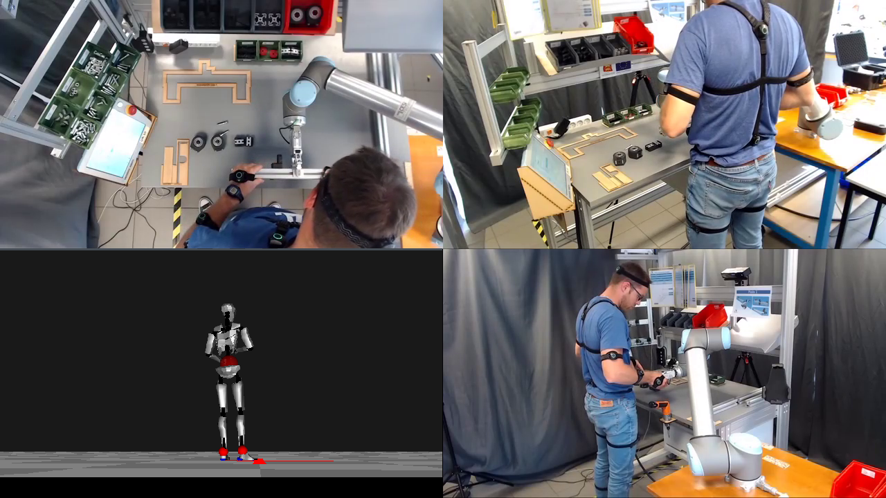
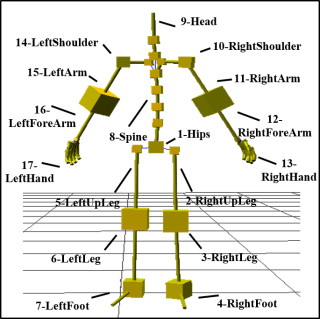

# InHARD - Industrial Human Action Recognition Dataset  

## Objectives
We introduce a RGB+S dataset named “Industrial Human Action Recognition Dataset” (InHARD) from a real-world setting for industrial human action recognition with over 2 million frames, collected from 16 distinct subjects. This dataset contains 13 different industrial action classes and over 4800 action samples. The introduction of this dataset should allow us the study and development of various learning techniques for the task of human actions analysis inside industrial environments involving human robot collaborations.

## Dataset description
The download link will be updated after reviewing process.  
**Reviewers**, please contact the main author to get the download link of the dataset.  



## Modalities  
### Skeleton modality 
We used a “Combination Perception Neuron 32 Edition v2” motion sensor to capture the skeletal data delivered at a frequency of 120 Hz.  
Skeleton data comprises :
* The 3D locations (Tx, Ty and Tz) of 17 major body joints
* The 3 rotations around each axis (Rx, Ry and Rz)  
Skeleton data are saved into **BVH format** files and are stored in the **Skeleton/ folder** of the InHARD dataset.  

<p align="center">
	
</p>

To manipulate BVH files, we recommand using the [PyMO python library](https://github.com/omimo/PyMO/)

### Video modality
We used 3 C920 cameras to capture RGB Data. Each camera captures three different views of the same action. For each setup, two cameras were placed at the same height but at two different horizontal angles: -45° and +45° to capture both left and right sides. The third camera is placed on top of the subjects to capture the top view. 

* Camera 1 always observes top views and is displayed on the top left quarter of the RGB video. 
* Camera 2 observes left side views and is shown on the top right quarter of the RGB video. 
* Camera 3 observes right side views and is displayed on the bottom right quarter of the RGB video as shown in figure above

RGB files are stored in the **RGB/ folder** of the InHARD dataset.

## Action Classes
The list of **13 meta-actions** and **74 actions** classes are available in the [Action-Meta-action-list.xlsx](rsc/Action-Meta-action-list.xlsx) file

Inside the InHARD.zip datatset, you will find the **InHARD.csv** file which provides a dataframe with all dataset info including Filename, Subject, Operation, Action low/high level label, Action start/end, Duration etc. in order to facilitate the dataset handling and use.  
See an extract below:  

| File_name | Subject | Operation | Action_label | Meta_action_number | Meta_action_label | Action_start_bvh_frame | Action_end_bvh_frame | Action_start_rgb_sec | Action_end_rgb_sec | Action_start_rgb_frame | Action_end_rgb_frame | Duration_sec | 
|:-------------:|:-------------:|:-----------------------------:|:-------------:|:-------------:|:-------------:|:-------------:|:-------------:|:-------------:|:-------------:|:-------------:|:-------------:|:-----:|
| P01_R01 | P01 | OP010 | [OP010] Consult sheets | 2 | Consult sheets | 323 | 1071 | 2.72 | 9.00 | 68 | 225 | 6.28 | 
| P01_R01 | P01 | OP010 | [OP010] Catch Fixture key  LARD | 7 | Picking left | 1342 | 1528 | 11.28 | 12.84 | 282 | 321 | 1.56 | 
| P01_R01 | P01 | OP010 | [OP010] Place LARD on Profile P360-1 | 12 | Assemble system | 1647 | 2247 | 13.84 | 18.88 | 346 | 472 | 5.04 | 
| P01_R01 | P01 | OP010 | [OP010] Catch Fixation FIXA1 | 6 | Picking in front | 2775 | 3028 | 23.32 | 25.44 | 583 | 636 | 2.12 | 
| P01_R01 | P01 | OP010 | [OP010] Place FIXA1 on LARD at 160mm | 12 | Assemble system | 3151 | 3428 | 26.48 | 28.80 | 662 | 720 | 2.32 | 

We used a software called [ANVIL](https://www.anvil-software.org/) to label our data. You can install it if you want to edit, add or remove actions from actions' labels files (.anvil) situated at the /Labels/ folder.

## Experiments and performance metrics

We propose a set of usage metrics of the InHARD dataset for future utilization. 
Firstly, we suggest dividing data into two levels; experts and beginners according to subject’s expertise with the manipulation. 
Thereby, all subjects performing the whole manipulation in less than 6 minutes as average total actions' duration, are selected as experts. The remaining subjects are categorized as beginners. 
We define the training and validation sets as follows :
* S_train={P01_R01, P01_R03, P03_R01, **P03_R03**, P03_R04, P04_R02, P05_R03, P05_R04, P06_R01, **P07_R01**, **P07_R02**, P08_R02, **P08_R04**, **P09_R01**, P09_R03, P10_R01, P10_R02, **P10_R03**, P11_R02, P12_R01, P12_R02, P13_R02, **P14_R01**, **P15_R01**, **P15_R02**, P16_R02}
* S_val={P01_R02, P02_R01, **P02_R02**, P04_R01, P05_R01, P05_R02, P08_R01, **P08_R03**, **P09_R02**, P11_R01, **P14_R02**, P16_R01}

**PS** : Samples in bold are selected as Experts. The remaining are selected as beginners.  

## Citation
To cite this work, please use:
``` 
@InProceedings{inhard2020ichms,
      author = {Mejdi DALLEL, Vincent HAVARD, David BAUDRY, Xavier SAVATIER},
      title = {InHARD - An Industrial Human Action Recogniton Dataset in the Context of Industrial Collaborative Robotics},
      booktitle = {IEEE International Conference on Human-Machine Systems ICHMS},
      month = September,
      year = {2020},
      url = {https://recherche.cesi.fr/inhard-industrial-human-action-recognition-dataset/}
}
```
